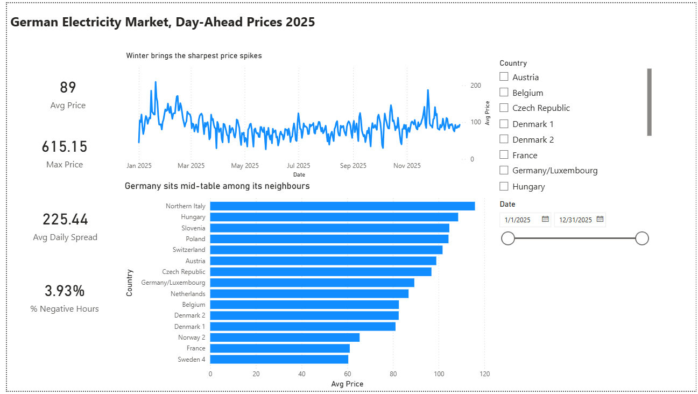

# German Electricity Market KPI Dashboard

A three page Power BI report on day-ahead electricity prices across 15 European
market areas in 2025, built from about 131,000 hourly records.

[Open the full three page report as a PDF](de-electricity-market-dashboard.pdf)

## Findings

- Germany and Luxembourg sit mid-table among the 15 market areas on average price,
  below Northern Italy, Hungary and Poland and above the Nordic zones.
- Winter brings the sharpest price spikes. The maximum hourly price reached
  EUR 615.15 against an annual average of EUR 89.
- Midday solar pushes prices to their daily low, while demand peaks in the evening.
  The average daily spread is EUR 225.44.
- 3.93% of hours carried negative prices, clustered in spring and early summer
  when solar output is high and demand is not.

## Model

Star schema with a generated date table, so time intelligence works correctly
across all 15 market areas.

A reusable DAX measure library covers filtered aggregation with CALCULATE,
iteration with AVERAGEX over dates, and time intelligence with PREVIOUSMONTH.

## Data quality

Two columns in the source data looked like market areas but carried no usable
values, a derived neighbour average and a discontinued price zone. Both were
removed in Power Query rather than filtered in the report, so every measure
stays correct wherever it is used.

## Files

- `de-electricity-market-dashboard.pbix`, the Power BI file
- `de-electricity-market-dashboard.pdf`, the report exported for viewing without Power BI

## Data

Day-ahead wholesale electricity prices for 15 European bidding zones,
1 January to 31 December 2025, hourly resolution.
